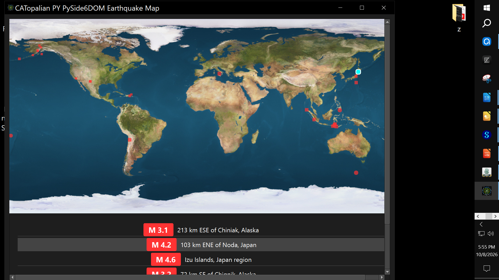
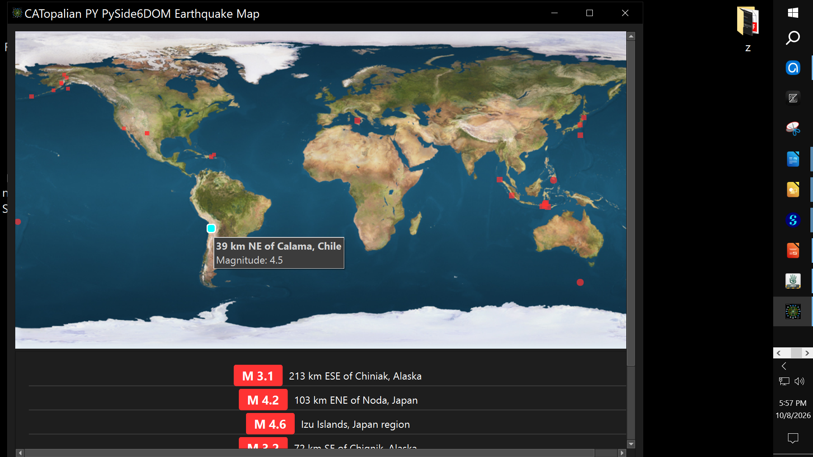
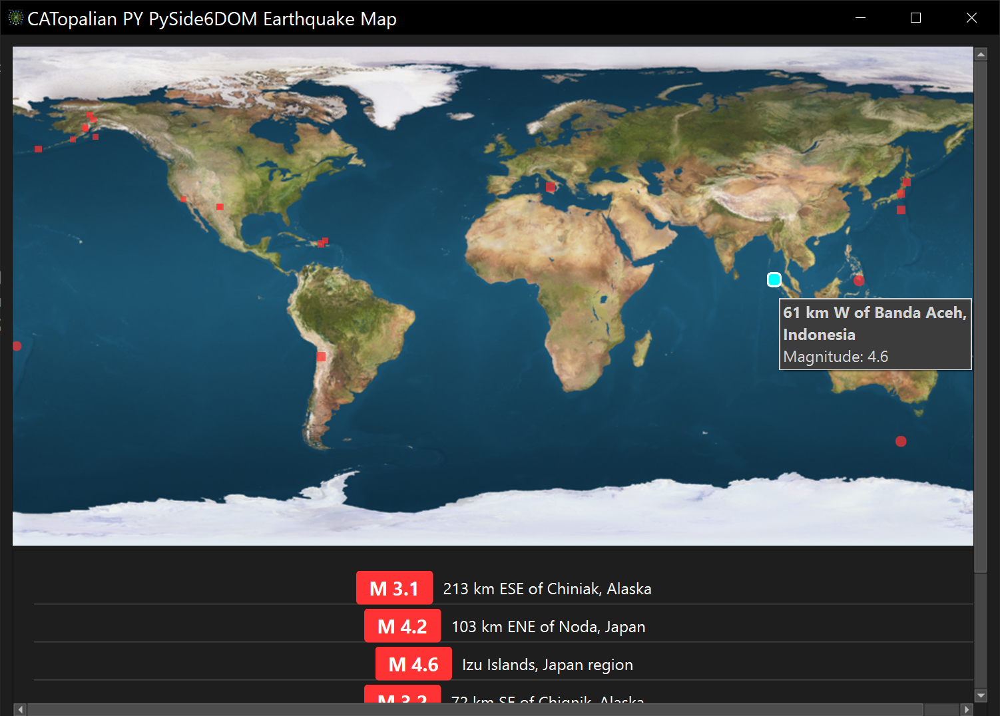
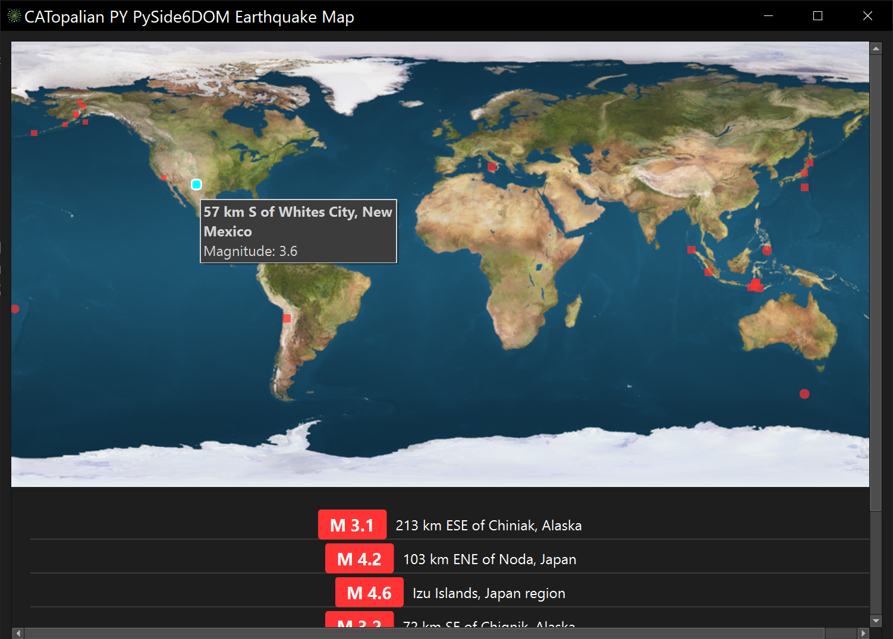

# CATopalian PY PySide6DOM Earthquake Map
This Python PySide6 PySide6DOM application tracks Earthquakes worldwide!
We can click on any Earthquake and it will open the Google map location precisely!

---

REQUIREMENTS:
* Python  
* PySide6  
* PySide6DOM

---

## pip install pyside6dom PySide6

---

Video: https://www.youtube.com/watch?v=auaqX0ar7wI

---

### How to Download this App
1. Click the green Code Button on this github page
2. Choose Download ZIP
3. Save the Zip File
4. Extract All
5. Double click the the .pyw file

---

Happy Scripting :-)

---

// Dedicated to God the Father  
// (c) Copyright 2026 Christopher Andrew Topalian All Rights Reserved  
// https://github.com/ChristopherAndrewTopalian  
// https://github.com/ChristopherTopalian  
// https://sites.google.com/view/CollegeOfScripting

